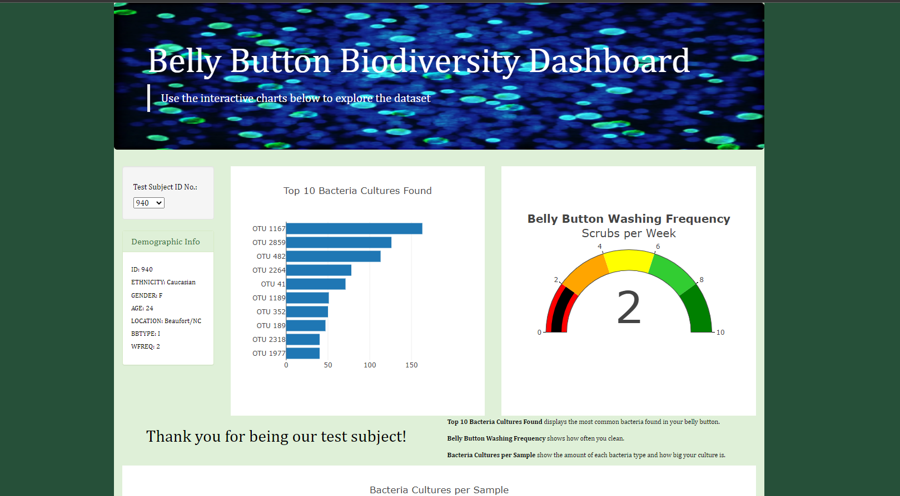
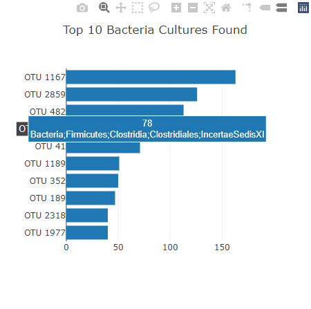
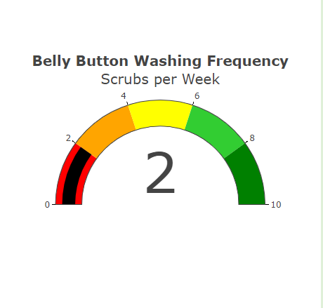
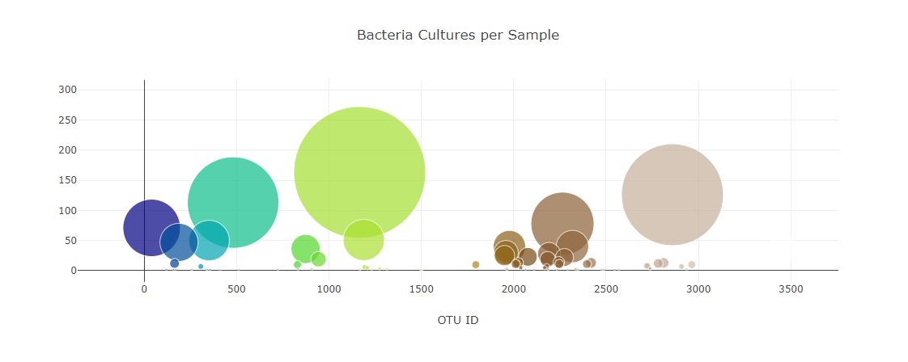

# Plotly_Deployment
Bellybutton biodiversity project

## Overview of Project
Create a dynamic page that shows charts in reference to test subject that shows biodiversity of bacteria in their belly button.

## Results
 

*Website with 3 charts*
Changes made:
-  jumbotron background image
- a fluid jumbotron style
- a panel color for description changed to bootstrap"success" color
- a page background of dark green
- divs set up to thank test subject and give details about chart
- font family changes

 

*This shows sample data for **test subject 940** which has a hover with the relevant bacteria*

 

*Shows how **test subject 940** compares in the cleaning frequency for belly button*

 

*Shows how much of each bacteria present in the belly button of **test subject 940** *

 
